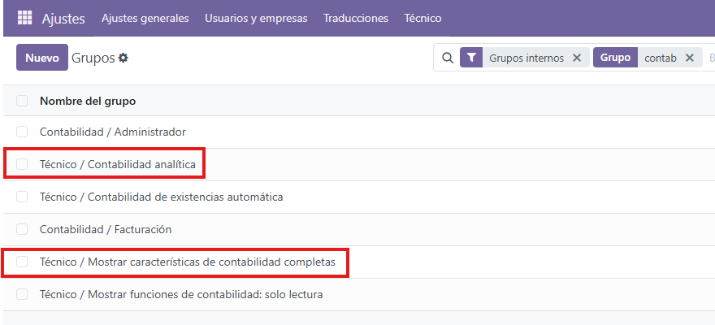
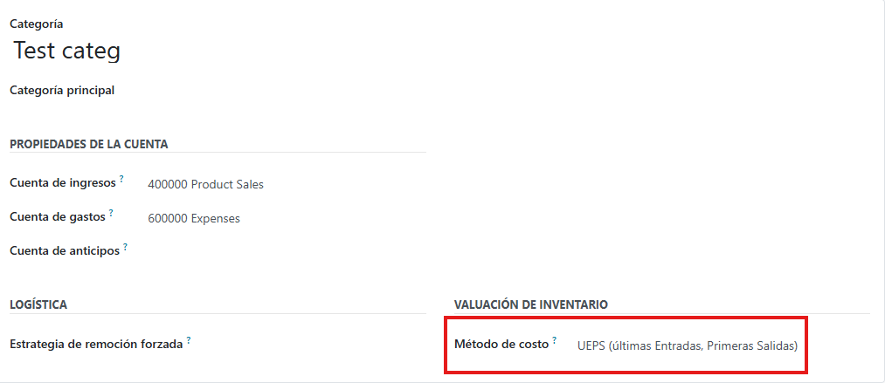

# 📦 Relación entre Movimientos de Stock y Cuentas Analíticas en Odoo

Este módulo permite establecer una relación entre los movimientos de stock y las cuentas analíticas en Odoo, facilitando la gestión contable de los productos.

## 🚀 Compatible con versiones de Odoo  
Este módulo es compatible con diferentes versiones de *Odoo Community versión 18.0*.

🔗 [Repositorio en GitHub](https://github.com/AlfaSystemas5457/account_analytic_with_stock)

---

## ⚙ Configuración Requerida  

Para que funcione correctamente, asegúrate de agregar el usuario a los siguientes grupos en Odoo:  

- *Contabilidad Analítica*  
- *Mostrar Características de Contabilidad Completas*  

Después de esto, solo es necesario reiniciar el navegador con:  
```bash
CTRL + R
```

### 🖼️ Ejemplo de configuración de grupos en Odoo:



## 📊 Nueva Funcionalidad: UEPS (Últimas Entradas, Primeras Salidas)

Este módulo ahora incluye la opción de UEPS (Últimas Entradas, Primeras Salidas) como método de costo para los productos en stock.

### 🖼️ Ejemplo del método de costo en Odoo:



## 📥 Instalación

Para instalar este módulo, sigue estos pasos:

1. Descargar el repositorio:

```bash
git clone https://github.com/AlfaSystemas5457/account_analytic_with_stock.git
```
1. Copiar la carpeta del módulo en la ruta de addons de Odoo.
1. Actualizar la lista de módulos en Odoo.
1. Instalar el módulo desde la interfaz de Odoo.

